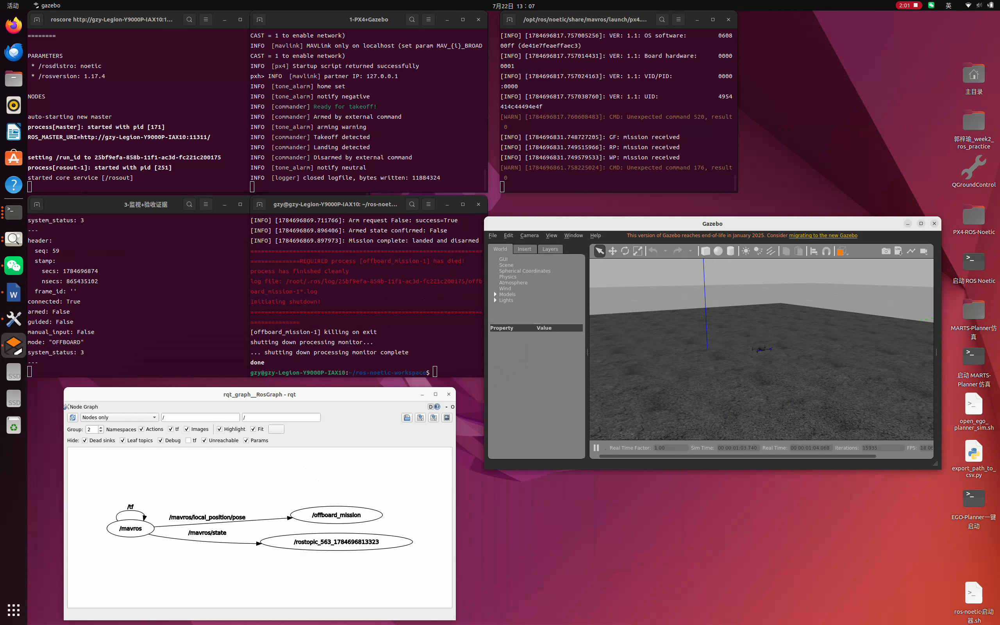

# week3_offboard

基于 ROS Noetic、PX4 v1.14、Gazebo Classic 11 和 MAVROS 的 Offboard 正方形航线实操。



## 项目结构

```text
week3_offboard/
├── CMakeLists.txt                    # catkin 构建配置及脚本、launch 安装规则
├── package.xml                       # ROS 包信息和 geometry_msgs、MAVROS 等依赖
├── README.md                         # 环境安装、启动步骤、通信关系和问题说明
├── .gitignore                        # Git 忽略规则
├── launch/
│   └── offboard_mission.launch       # 配置高度、边长等参数并启动 MAVROS 和任务节点
├── scripts/
│   ├── offboard_mission.py           # OFFBOARD 起飞、正方形航线、降落和安全保护
│   └── start_week3_host.sh           # 从宿主机启动并排列 Docker 内各任务终端
├── images/
│   └── task1_acceptance_overview.png # Gazebo、完成日志和 rqt_graph 总览图
└── videos/
    └── week3_task1_demo.mp4          # 起飞、正方形飞行、返航和降落完整录屏
```

## 实操结果

任务航线：起飞到 2 m、悬停 5 s、飞行边长 5 m 的正方形、回到起点、自动降落，确认接地后解除武装。航点容差为 0.25 m。

## 复现环境

推荐在 Ubuntu 20.04 宿主机直接运行，不要求 Docker。已验证的软件组合：

- ROS Noetic
- PX4-Autopilot v1.14.x
- Gazebo Classic 11
- MAVROS 1.20.x
- Python 3

先确认基础环境可用：

```bash
test -f /opt/ros/noetic/setup.bash
test -f "$HOME/PX4-Autopilot/Makefile"
gazebo --version
source /opt/ros/noetic/setup.bash
rospack find mavros
```

如果 MAVROS、rqt_graph 或 GeographicLib 数据尚未安装：

```bash
sudo apt update
sudo apt install ros-noetic-mavros ros-noetic-mavros-extras \
  ros-noetic-rqt-graph
sudo /opt/ros/noetic/lib/mavros/install_geographiclib_datasets.sh
```

以下步骤假设 PX4 位于 `~/PX4-Autopilot`，catkin 工作空间位于
`~/catkin_ws`。如果路径不同，只需替换对应路径。

## 宿主机从零复现（无需 Docker）

### 1. 克隆并编译

```bash
source /opt/ros/noetic/setup.bash
mkdir -p ~/catkin_ws/src
cd ~/catkin_ws/src
git clone https://github.com/GZY77-create/week3_offboard.git
cd ~/catkin_ws
catkin_make --pkg week3_offboard
source devel/setup.bash
```

### 2. 启动 PX4 SITL 和 Gazebo

打开终端 1：

```bash
cd ~/PX4-Autopilot
make px4_sitl gazebo-classic_iris
```

等待 Gazebo 中出现 Iris，并等待 PX4 控制台显示 `Ready for takeoff!`。

### 3. 启动 MAVROS

打开终端 2：

```bash
source /opt/ros/noetic/setup.bash
source ~/catkin_ws/devel/setup.bash
roslaunch mavros px4.launch \
  fcu_url:=udp://:14540@127.0.0.1:14580
```

确认出现 `Got HEARTBEAT, connected`。也可以新开终端检查：

```bash
source /opt/ros/noetic/setup.bash
rostopic echo -n 1 /mavros/state
```

输出中的 `connected` 必须为 `True`。

### 4. 执行正方形飞行任务

打开终端 3：

```bash
source /opt/ros/noetic/setup.bash
source ~/catkin_ws/devel/setup.bash
roslaunch week3_offboard offboard_mission.launch start_mavros:=false
```

成功时日志依次包含：

```text
Reached takeoff
Reached corner_1
Reached corner_2
Reached corner_3
Reached corner_4
Square complete
Mission complete: landed and disarmed
```

飞行过程中不要关闭 PX4、Gazebo 或 MAVROS。需要中止时，在任务终端按
`Ctrl+C`，节点会请求 `AUTO.LAND`。

### 5. 验收检查与正常关闭

可在额外终端运行：

```bash
source /opt/ros/noetic/setup.bash
rostopic hz /mavros/setpoint_position/local
rostopic echo /mavros/state
rqt_graph
```

任务结束后确认 `armed: False`，再依次关闭任务终端、MAVROS，最后在 PX4
控制台输入 `shutdown` 关闭 PX4 和 Gazebo。

### 调整航线参数

```bash
roslaunch week3_offboard offboard_mission.launch \
  start_mavros:=false \
  altitude:=2.0 side_length:=2.0 hover_seconds:=5.0
```

## Docker 一键运行（可选）

此方式仅适用于已经有名为 `ros-noetic` 的容器，且容器内已有
`/root/PX4-Autopilot`、ROS Noetic、Gazebo 和 MAVROS 的电脑。脚本必须在
宿主机终端执行：

```bash
cd /path/to/catkin_ws/src/week3_offboard
xhost +si:localuser:root
./scripts/start_week3_host.sh
```

将 `/path/to/catkin_ws` 替换为宿主机工作空间实际路径。容器未运行时脚本会
自动启动；容器名不是 `ros-noetic` 时使用：

```bash
ROS_CONTAINER=实际容器名 ./scripts/start_week3_host.sh
```

脚本会启动 ROS Master、PX4 SITL + Gazebo、MAVROS、Offboard 任务、
`rqt_graph` 和 `/mavros/state` 状态监视，并根据屏幕分辨率排列终端。

## 飞行流程

1. 等待 `/mavros/state` 的 `connected=True` 和有效本地位置。
2. 以 20 Hz 预发送起飞目标点 5 秒。
3. 请求 `OFFBOARD`，确认成功后才请求解锁。
4. 起飞到 2 m，悬停 5 秒。
5. 依次飞过四个正方形航点并返回起点。
6. 请求 `AUTO.LAND`，通过 `/mavros/extended_state` 确认接地后再解除武装。

## 节点通信关系

一键脚本会将 `rqt_graph` 设为简洁的 **Nodes only** 视图，便于录屏展示控制节点与 MAVROS 的关系。核心链路为：

```text
PX4 SITL <--UDP/MAVLink--> /mavros <--ROS topics/services--> /offboard_mission

/mavros/state ------------------------------> /offboard_mission
/mavros/local_position/pose ----------------> /offboard_mission
/mavros/extended_state ---------------------> /offboard_mission
/offboard_mission -- setpoint_position/local --> /mavros --> PX4
/offboard_mission -- cmd/arming service ------> /mavros --> PX4
/offboard_mission -- set_mode service --------> /mavros --> PX4
```

| 名称 | 类型 | 方向 | 用途 |
|---|---|---|---|
| `/mavros/state` | `mavros_msgs/State` | MAVROS → 控制节点 | 获取连接、解锁和模式状态；未连接时禁止解锁。 |
| `/mavros/local_position/pose` | `geometry_msgs/PoseStamped` | MAVROS → 控制节点 | 获取 ENU 本地位置，用于航点到达判定和误差保护。 |
| `/mavros/extended_state` | `mavros_msgs/ExtendedState` | MAVROS → 控制节点 | 读取 `landed_state`，确认接地后才允许解除武装。 |
| `/mavros/setpoint_position/local` | `geometry_msgs/PoseStamped` | 控制节点 → MAVROS | 以 20 Hz 发送本地位置目标。 |
| `/mavros/cmd/arming` | `mavros_msgs/CommandBool` 服务 | 控制节点 → MAVROS | 请求解锁或上锁。 |
| `/mavros/set_mode` | `mavros_msgs/SetMode` 服务 | 控制节点 → MAVROS | 请求 `OFFBOARD` 和 `AUTO.LAND`。 |

MAVROS 使用 ENU 坐标系（x 向东、y 向北、z 向上），并负责与 PX4 的 NED 坐标系转换。

## 异常处理

节点实现了四项保护：

1. **未连接不解锁**：等待 FCU 和本地位置；解锁前再次检查 `state.connected`，断开时抛出安全异常。
2. **模式切换失败重试**：`OFFBOARD`/`AUTO.LAND` 每 2 秒请求一次，持续确认反馈，30 秒超时后安全中止。
3. **位置误差过大悬停**：误差超过 8 m 时，将当前位置设为目标并连续发布 3 秒，随后进入 `AUTO.LAND`。该阈值高于正常的 5 m 单段航线，不会将第一个角点误判为异常。
4. **Ctrl+C 安全退出**：ROS shutdown 回调检查是否仍解锁；若在空中则请求 `AUTO.LAND`。

任何飞行阶段检测到 FCU 断开、意外退出 `OFFBOARD` 或航点超时，也会中止任务并请求自动降落。

## 任务一实际报错与解决过程

### 1. ROS Master 无法连接

**报错：**

```text
ERROR: Unable to communicate with master!
XmlRpcClient::writeRequest: write error (Connection refused)
```

**原因：** 原脚本依赖 `roslaunch` 自动创建 ROS Master，并用固定 `sleep` 安排启动顺序。不同进程的实际启动时间不固定，监视节点可能在 Master 尚未就绪时运行。

**解决：** `start_week3_host.sh` 新增独立的 `0-ROS Master` 终端运行 `roscore`。MAVROS 循环检查 Master，监视和任务节点则等待 `/mavros/state` 出现，不再只依赖固定延时。

**验证：** `rosnode list` 能稳定显示 `/mavros`、`/offboard_mission` 和 `/rosout`，`/mavros/state` 中显示 `connected: True`。

### 2. 起飞后未飞正方形就中止

**报错：**

```text
Mission aborted: Position error 5.02 m exceeded limit; holding
```

**原因：** 正方形边长和 `max_position_error` 都是 5 m。从起点切换到 `corner_1` 时，正常初始距离已经约为 5 m，叠加少量位置波动后成为 5.02 m，因此被误判为飞行异常。

**解决：** launch 中将 `max_position_error` 改为 8 m，高于正常的 5 m 航段。Python 节点还会检查该阈值必须大于 `side_length`。超过阈值时仍保留原地悬停 3 秒和 `AUTO.LAND` 保护。

**验证：** 任务日志应依次出现：

```text
Reached takeoff
Reached corner_1
Reached corner_2
Reached corner_3
Reached corner_4
Square complete
```

### 3. PX4 重复启动

**报错：**

```text
ERROR: PX4 server already running for instance 0
```

**原因：** 上一轮仿真结束时，PX4、Gazebo 或 MAVROS 子进程没有全部退出，再次启动后与旧实例冲突。

**解决：** 先确认飞行器已接地且 `armed: False`，再清理残留任务：

```bash
docker restart ros-noetic
```

之后只在宿主机运行一次 `./scripts/start_week3_host.sh`。

### 4. Gazebo 只有服务、没有画面

**现象：** 容器内有 `gzserver`，但没有 `gzclient`，宿主机不显示 Gazebo GUI。

**原因：** 容器内的 root 用户未获得当前宿主机 X11 会话的图形窗口权限。

**解决：** 在宿主机执行：

```bash
xhost +si:localuser:root
./scripts/start_week3_host.sh
```

容器需要挂载 `/tmp/.X11-unix` 并设置 `DISPLAY=:0`。一键脚本必须在宿主机终端运行，不应在容器内运行。

**验证：** 容器内同时存在 `gzserver`、`gzclient` 和 `px4`，宿主机能看到 Iris 与 Gazebo 场景。

### 5. 降落时重复拒绝解除武装

**报错：**

```text
WARN [commander] Disarming denied! Not landed
```

**原因：** 旧逻辑切换到 `AUTO.LAND` 后立即循环请求解除武装。PX4 检测到飞行器仍在空中，因此出于安全考虑拒绝请求。

**解决：** 节点新增订阅 `/mavros/extended_state`。请求 `AUTO.LAND` 后先等待 `landed_state == LANDED_STATE_ON_GROUND`，确认接地后才解除武装；如果 PX4 已自动解除武装，直接判定任务完成。

**验证：** 降落时应看到 `AUTO.LAND: waiting for touchdown`，最终看到 `Mission complete: landed and disarmed`。地面状态为 `landed_state: 1` 和 `armed: False`。

## 检查与排错

```bash
rostopic echo /mavros/state
rostopic hz /mavros/setpoint_position/local
rostopic echo /mavros/local_position/pose
rostopic echo /mavros/extended_state
rqt_graph
```

## 验收录屏

- 文件：[`videos/week3_task1_demo.mp4`](videos/week3_task1_demo.mp4)
- 时长：2 分 03 秒
- 分辨率：2560 × 1600，30 FPS

[▶ 查看或下载完整验收录屏](videos/week3_task1_demo.mp4)

录屏包含 Gazebo 中的完整起飞、悬停、正方形航线、返航和降落过程；终端最终
显示 `Mission complete: landed and disarmed`，`/mavros/state` 显示
`connected: True`、`armed: False`，并展示 `rqt_graph` 中
`/offboard_mission` 与 `/mavros` 的通信关系。

## 全新 Ubuntu 20.04 验收标准

每次复现前先确认没有旧的仿真进程：

```bash
pgrep -af 'px4|gzserver|gzclient|mavros' || true
```

若存在上一次运行的进程，先正常关闭对应终端后再开始。按上文三个终端的顺序
启动；不要同时运行 `start_mavros:=true` 和手工启动 MAVROS。验收必须同时满足：

```text
connected: True
Reached corner_1
Reached corner_2
Reached corner_3
Reached corner_4
Mission complete: landed and disarmed
```

若没有最后一行，任务不算复现成功，即使 Gazebo 窗口已经打开也不算成功。
